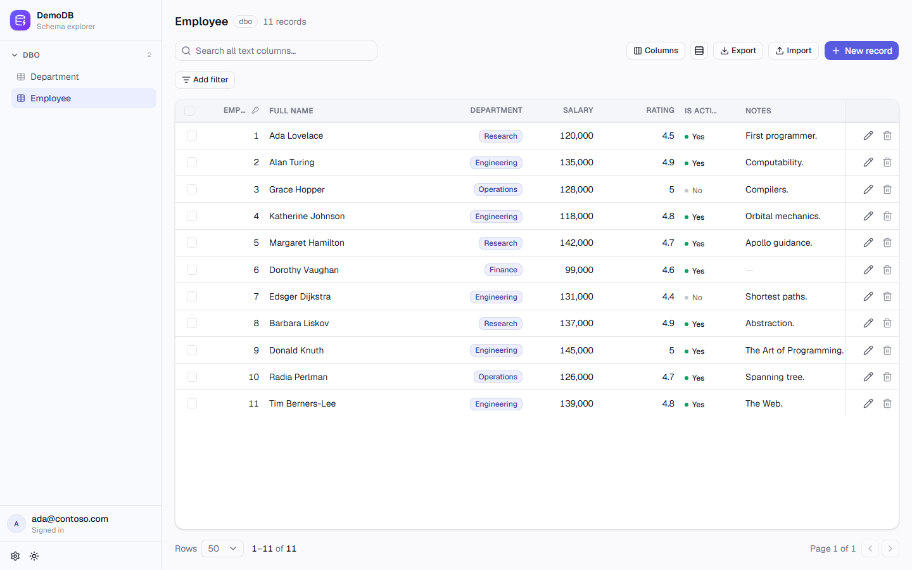

# Auto CRUD

[](https://github.com/markadams31/autocrud/actions/workflows/deploy-dev.yml)
[](https://github.com/markadams31/autocrud/actions/workflows/codeql.yml)
[](LICENSE)

A single FastAPI application that deploys against any Azure SQL database and instantly
exposes a full CRUD API — and a matching web UI — for every table it finds, with no
hand-written models, no table-specific code, and no redeployment when the schema changes.
A generic, metadata-driven React SPA is served from the same origin; it builds its forms
and data grids live from the API's metadata endpoints, so it adapts to schema changes with
no frontend work.



*Every part of this screen — the sidebar, the grid, the filters, the controls — is generated at
runtime from the API's metadata; nothing is table-specific. See [The web UI](#the-web-ui).*

## The idea

Teams frequently need simple web apps to manage structured data. The conventional path —
a bespoke repo, models, routes, and frontend per request — creates a maintenance burden
that scales with the number of apps. This is a different approach: one codebase, deployed
as many times as needed, each instance pointed at a different database via environment
variables.

```
One codebase  +  One database (per instance)  =  One deployed app
```

A new data management need becomes a database provisioning task, not a software
development task. Schema changes — new tables, new columns, altered constraints — take
effect immediately after a refresh with no code change and no deployment. The people who
own the data own the schema; the application adapts to whatever they publish.

## How it works

On startup, the app reflects the live schema from Azure SQL and builds two Pydantic
validation models per table (create and update). Every reflected table immediately gets
a full set of endpoints:

| Endpoint | Description |
|---|---|
| `POST /api/{schema}/{table}/query` | Search, filter, sort, paginate |
| `GET /api/{schema}/{table}/{pk}` | Fetch a single row |
| `POST /api/{schema}/{table}` | Insert a row |
| `PUT /api/{schema}/{table}/{pk}` | Update a row (partial semantics — identical to PATCH) |
| `PATCH /api/{schema}/{table}/{pk}` | Partial update |
| `DELETE /api/{schema}/{table}/{pk}` | Delete a row |
| `POST /api/{schema}/{table}/bulk-delete` | Delete many rows atomically — by id list or "all matching" a filter |
| `POST /api/{schema}/{table}/bulk-update` | Apply one change to many rows atomically — by id list or "all matching" a filter |
| `POST /api/{schema}/{table}/bulk-create` | Import many rows atomically (validate-all, then insert-all in one transaction) |
| `GET /meta` | List reflected schemas and the connected database name |
| `GET /meta/{schema}` | List reflected tables in a schema (permission-filtered) |
| `GET /meta/{schema}/{table}` | Column-level metadata for a table |
| `GET /meta/{schema}/{table}/options/{column}` | FK dropdown values for a column |
| `POST /admin/refresh` | Re-reflect schema without restarting |
| `GET /health` | Health check |
| `GET /me` | The signed-in user's EasyAuth identity (for the UI) |

The backend serves the React SPA from the same origin at `/`. When a production build is
present at `backend/app/frontend/dist`, it is mounted as a catch-all after all API routes;
the SPA builds its forms and data grids dynamically from the metadata endpoints, so no
frontend changes are needed when the schema evolves. When no build is present, the backend
logs a warning at startup and runs API-only.

## The web UI

The SPA is **metadata-driven**: the sidebar, the data grid, and every filter and form control
are built at runtime from the API's metadata endpoints, so a new table or column shows up in the
UI on the next refresh with no frontend change. What that gives you out of the box:

- **Schema explorer** — browse the connected database, its schemas, and tables from the sidebar.
- **Data grid** — search, multi-column sort, and pagination, with foreign keys resolved from raw
  ids to their human-readable display label (e.g. `DepartmentID` → *Engineering*).
- **Type-aware filtering** — operators are chosen from each column's type: `contains` /
  `starts with` for text, `=` `≠` `>` `<` `between` for numbers, `is null` / `in`, and so on.
- **Type-aware inputs** — a searchable **combobox** for foreign keys (type to filter by label), a
  **number field** with steppers and scrub-to-change for integers, a switch for booleans, and
  date pickers; decimals stay plain text so precision is never lost to a float round-trip.
- **Create, edit, and inline edit** — record forms generated from the column metadata, enforcing
  the same required/validation rules as the API, plus double-click-to-edit on a grid cell.
- **Bulk operations** — select rows (or *all rows matching the current filter*) to apply one edit
  across many, or bulk-delete — each applied atomically in a single transaction.
- **Undoable deletes** — deletes happen instantly with an Undo toast rather than a confirm dialog.
- **CSV import / export** — export the displayed (filtered) rows; import from a template with
  foreign-keys-by-label resolution and per-cell validation before anything is written.
- **Command palette** — `Ctrl` / `⌘ K` to jump straight to any table.
- **Column controls** — show or hide columns, including a one-click *hide database-managed
  columns* (identity keys and audit columns).
- **Safe concurrent edits** — for a table with a `rowversion`, a conflicting save is detected,
  surfaced clearly, and the latest row refetched — no silent lost updates.
- **Auth-aware** — shows the signed-in user, and New / Edit / Delete appear only where the user's
  real SQL grants allow; an expired session is refreshed and the request replayed transparently.

The frontend stack and architecture are documented in [`frontend/README.md`](frontend/README.md).

## Project layout

```
autocrud/
├── backend/                  FastAPI service — the deployable application
│   ├── app/
│   │   ├── main.py               Entry point: app wiring, exception handler, SPA mount
│   │   ├── config.py             Required env vars, validated once at startup
│   │   ├── connection.py         Reflection (managed identity) + data (signed-in user) connections
│   │   ├── reflection.py         Schema introspection, column classification, model factory
│   │   ├── state.py              Current schema snapshot, swappable at runtime
│   │   ├── errors.py             The single error contract
│   │   ├── routes/               The endpoints — crud · meta · admin · identity
│   │   └── …                     Supporting modules: request logging, security headers, telemetry
│   ├── run.py                    Local dev launcher (uvicorn with reload)
│   ├── dev_auth_proxy.py         Local-only EasyAuth emulator (never imported by the app)
│   └── pyproject.toml            Package metadata + dependencies
├── frontend/                 React SPA — metadata-driven UI (see frontend/README.md)
│   └── src/                      Components, hooks, typed API client, formatters
├── infra/                    Terraform — Azure deployment (see infra/README.md)
│   ├── modules/autocrud/         Canonical definition of one environment
│   └── environments/{dev,prod}/  Per-environment configuration
├── database/                 Example schema + access setup (SQL Server)
│   ├── seed.sql                  Sample Project Portfolio schema, data, audit triggers
│   └── permissions.sql           Contained users and grants for the app-users group
├── Dockerfile                Multi-stage build — frontend + backend in one image
├── .dockerignore             Keeps the ACR/Docker build context small (excludes deps, infra, .git)
├── .env.example
└── LICENSE                   MIT
```

The backend reflects the schema and serves both the API and the built SPA from one origin;
`frontend/` is a complete metadata-driven UI; `infra/` deploys the whole thing to Azure. 
The backend serves the SPA from `backend/app/frontend/dist` when a build is present — the 
repo-root `Dockerfile` produces this automatically — and runs API-only when it isn't.

## Architecture

```
Azure App Service
│
├── EasyAuth (Microsoft Entra ID)
│   ├── Gates access via application role membership
│   ├── Acquires the user's Azure SQL token (refreshed on demand via /.auth/refresh)
│   └── Injects identity headers into every request
│
├── FastAPI
│   ├── Schema reflection    →  SQLAlchemy reflects live schema at startup
│   ├── Model factory        →  Pydantic create/update models per table
│   ├── Generic CRUD routes  →  all endpoints, no per-table code
│   └── React SPA            →  served from root, driven by metadata endpoints
│
└── Azure SQL
    ├── Schema owned by whoever owns the data (example: database/seed.sql)
    └── Authorization via SQL grants and Entra security groups
```

## Authentication and authorisation

The app uses two distinct identities for two distinct purposes.

**Managed identity** is used exclusively for schema reflection at startup and on
refresh. It reads database metadata and nothing else — it cannot read or write data rows.

**Signed-in user (OBO)** is used for all data access. EasyAuth acquires the user's Azure
SQL token and injects it into request headers; the app passes it directly to the database
connection. SQL Server authenticates the real caller — `SUSER_SNAME()` returns the
signed-in user's identity, not the application's.

**Session expiry.** EasyAuth keeps injecting the user's token but does not refresh it on
its own, so it eventually lapses (~1 hour). Rather than forward a dead token to SQL Server
and surface a confusing database error, the backend inspects the token's expiry up front
and returns a clean `401 UNAUTHENTICATED`. The SPA reacts by silently refreshing the
session via EasyAuth's `/.auth/refresh` endpoint and replaying the request — falling back
to a sign-in redirect only if the refresh itself fails. Because the 401 is raised before
any database work, replaying a write is safe (the first attempt never executed). The user
keeps working with no manual step.

Authorization lives entirely in SQL. Security groups are provisioned as contained database
users with table and schema-level grants. The app enforces no access rules of its own: if
the database allows it, the API allows it; if the database denies it, the API returns a
permission error.

No credentials appear in application configuration. No OAuth flow runs inside the
application.

## Column classification

Every reflected column is classified so the API and UI know what a client may write:

**User-editable** — surfaced in the generated models and the frontend form. The columns a
client can read and write.

**DB-owned** — read-only to the client and excluded from every write. The database
generates the value and SQL Server will reject any attempt to set it explicitly:
- `IDENTITY` columns (auto-increment PKs)
- Computed / persisted `AS` columns
- Columns with a value-generating default (e.g. `SYSUTCDATETIME()`, `NEWID()`)
- `GENERATED ALWAYS` columns (temporal table period columns, detected via `sys.columns`)

Audit tracking (who created or last modified a row, and when) belongs in this category,
with one twist: SQL Server exposes no metadata linking a trigger to the columns it writes,
so audit columns can't be detected structurally. They are identified by name instead, via
the `DB_AUDIT_COLUMNS` setting — **empty by default**; the example deployment sets the four
conventional names (`CreatedBy`, `CreatedDate`, `ModifiedBy`, `ModifiedDate`). Named columns
are then treated as DB-owned. Because all data connections run as the signed-in user,
`SUSER_SNAME()` is available to `DEFAULT` constraints and `AFTER UPDATE` triggers and
resolves to the real caller — so audit columns are owned and populated by the database, not
the application. This keeps audit logic consistent across every tool that touches the data,
not just this API.

**Excluded** — a small set of types that aren't safely writable through a generic layer:
binary / `rowversion`, `XML`, and `sql_variant`. Binary and XML are surfaced read-only in
metadata; `sql_variant` is omitted entirely (no fixed shape).

Temporal history tables are excluded from the API entirely (detected via `sys.tables`,
`temporal_type = 1`). Tables without a primary key are also excluded.

## Concurrent edits

When a table has a SQL Server **`rowversion`** (a.k.a. `timestamp`) column, the API
uses it for **optimistic concurrency control**, so two people editing the same row
can't silently overwrite each other. Reads return the row's current rowversion (the
8-byte value, hex-encoded); an update or delete sends it back in an **`If-Match`**
header, and the write only lands if the row still carries that version. If it
changed in the meantime the API returns **`409 CONFLICT`** (distinct from a `404`
for a row that's genuinely gone), and the UI tells the user the record changed,
refetches the latest, and asks them to reapply — no lost update.

This is **automatic and per-table**: reflection detects the rowversion column and
exposes it as `concurrency_token` in the table metadata. A table **without** a
rowversion simply falls back to last-writer-wins — protection is
additive, so adding a `rowversion` column (one line of DDL, picked up on the next
schema refresh) opts a table in with no other change. Concurrency control applies to
single-row update and delete; bulk operations remain last-writer-wins.

## Schema conventions

The app makes a small number of structural assumptions. Following these conventions
produces the best experience with no additional configuration.

### FK display labels

When a column has a foreign key, the frontend resolves the raw ID to a human-readable
label by inspecting the referenced table. The lookup uses this priority order:

1. A non-PK, editable column whose name contains `name`, `label`, `title`, `description`,
   or `code` — checked in that priority order, case-insensitive
2. The first non-PK, editable string column
3. The raw value if no suitable column is found

Naming a display column descriptively is sufficient — no additional configuration needed:

```sql
-- "ColourName" matches the "name" hint and will be used as the display label
CREATE TABLE dbo.Ref_Colour (
    ColourID   INT           IDENTITY(1,1) NOT NULL PRIMARY KEY,
    ColourName NVARCHAR(100) NOT NULL
);
```

## Environment variables

| Variable | Required | Description |
|---|---|---|
| `DB_SERVER` | Yes | Azure SQL server hostname |
| `DB_DATABASE` | Yes | Database name |
| `DB_SCHEMAS` | Yes | Comma-separated list of schemas to reflect (e.g. `dbo` or `dbo,hr,finance`) |
| `DB_DRIVER` | Yes | ODBC driver string (e.g. `ODBC Driver 18 for SQL Server`; `17` also works) |
| `DB_AUDIT_COLUMNS` | No | Comma-separated, case-insensitive names of database-managed/audit columns to exclude from writes (none by default) |
| `BULK_MAX_ROWS` | No | Max rows a single bulk operation (delete or update) may touch in one transaction — defaults to `1000` |
| `LOG_LEVEL` | No | `DEBUG`, `INFO`, or `WARNING` — defaults to `INFO` |
| `LOG_USER_IDENTITY` | No | How the signed-in user appears in logs: `email` (default), `hash` (a stable pseudonym, no PII), or `none` |
| `LOG_USER_IDENTITY_SALT` | No | Salt for `hash` mode, to resist reversing known addresses (empty by default) |
| `APPLICATIONINSIGHTS_CONNECTION_STRING` | No | Enables Azure Application Insights export when set (injected by App Service in Azure); telemetry is a no-op without it |
| `APPINSIGHTS_SAMPLING_RATIO` | No | Fraction of request traces to keep, `0.0`–`1.0` — defaults to `1.0` |

Every request is logged on one line (method, path, status, latency) and assigned a request id,
returned as the `X-Request-ID` response header and stamped onto **every** log line for that request
(`%(request_id)s`). To debug a user-reported issue, grab the id from their `X-Request-ID` header (or
the access line) and filter the logs by it to see everything that request did. An inbound
`X-Request-ID` (e.g. from a gateway) is honoured for tracing across hops.

The app fails fast on startup if any required variable is missing or empty, reporting all
missing variables in a single error rather than one at a time.

## Running locally

The app authenticates every database connection as a real Microsoft Entra user, so a
local run needs an **Azure SQL database** and an **Entra identity** — there is no SQL
username/password or local-only code path (by design). Plan on ~15 minutes the first time;
most of it is one-off database setup. The steps below take a fresh clone to a running app.

### How auth works locally (read once)

In production, App Service **EasyAuth** validates the user's Entra identity, acquires an
Azure SQL-scoped token on their behalf, and injects both into request headers the app
reads. None of that exists on your machine.

The **dev-auth proxy** (`backend/dev_auth_proxy.py`) fills the gap. It's a standalone
script — never imported by the app — that reuses your `az login` session to acquire the
same two values EasyAuth would inject (your identity header and an Azure SQL access token),
and adds them to every request it forwards to the app. It also refreshes the token within
the session. This is why the application code stays clean: it reads the same headers in
both environments, with no dev-mode branches. **You therefore browse the app through the
proxy, not the app directly.**

### Prerequisites

| Need | Why | Notes |
|---|---|---|
| **[uv](https://docs.astral.sh/uv/)** | Installs and runs the backend | `uv sync` builds the venv from `pyproject.toml`; `uv run` executes in it. uv provides Python 3.13+ itself, and brings its own build frontend (no reliance on system pip). |
| **Node.js 22** | Frontend dev server / build | |
| **ODBC Driver 18 for SQL Server** | `pyodbc` connects through it | [Install guide](https://learn.microsoft.com/sql/connect/odbc/download-odbc-driver-for-sql-server). Driver 17 also works — set `DB_DRIVER` to match. |
| **Azure CLI, signed in** (`az login`) | The app reflects the schema as *your* Azure identity at startup | Locally, `DefaultAzureCredential` resolves to your `az login` session. |
| **An Azure SQL database** | The app reflects and serves a live schema | Any Azure SQL DB you can reach. (If you provisioned with the Terraform in [`infra/`](infra/), it already exists.) |
| **An Entra security group, with your account as a member** | Data access is authorised by SQL grants to this group | Your membership lets your identity both reflect the schema and read/write data. |

### 1. Set up the database

Run the two scripts in [`database/`](database/) against your Azure SQL database, using a
tool that supports Entra sign-in — Azure Data Studio, SSMS, or `sqlcmd -G`:

1. **`seed.sql`** — creates the `dbo` and `ppm` schemas, the sample *Project Portfolio*
   data, and the audit triggers. This example uses **`DB_SCHEMAS=dbo,ppm`**.
2. **`permissions.sql`** — open it and set `@GroupName` (near the top) to your Entra
   security group, then run it. It creates a contained database user for the group and
   grants it CRUD on the `dbo` and `ppm` schemas.

```bash
# -G uses your Entra identity; -U triggers browser-based sign-in (no password).
# -l 60 extends the login timeout to accommodate the browser flow (the default 8s
# is too short for interactive sign-in). Azure Data Studio / SSMS also work.
sqlcmd -S <server>.database.windows.net -d <database> -G --authentication-method ActiveDirectoryAzCli -i database/seed.sql
sqlcmd -S <server>.database.windows.net -d <database> -G --authentication-method ActiveDirectoryAzCli -i database/permissions.sql
```

### 2. Configure environment

```bash
# From the repo root — .env is loaded automatically on startup
cp .env.example .env
```

Edit `.env` and set:

- `DB_SERVER` / `DB_DATABASE` — your Azure SQL server and database
- `DB_SCHEMAS=dbo,ppm` — **must match what `seed.sql` created**

Leave `DB_AUDIT_COLUMNS` as shipped — it matches the seed's audit triggers. The dev-auth
proxy reuses your `az login` session, so no tenant id goes in `.env`.

> **`.env` location:** `config.py` calls `load_dotenv()`, which searches upward from the
> source file, so one `.env` at the repo root is found whether you launch from `backend/`
> or the root — no need to duplicate it.

### 3. Install the backend

```bash
cd backend
uv sync          # creates .venv from pyproject.toml and installs the app + dependencies
```

uv writes a `uv.lock` for reproducible installs (commit it). `uv run` (next step)
auto-syncs, so this step is optional — but it makes the first install explicit.

### 4. Run all three processes (one terminal each)

```bash
# Terminal 1 — the API (port 8000)
cd backend && uv run python run.py
# (equivalent: uv run uvicorn app.main:app --reload)

# Terminal 2 — dev auth proxy (port 8001). Injects the identity + Azure SQL token 
# headers on every forwarded request.
cd backend && uv run python dev_auth_proxy.py

# Terminal 3 — the frontend dev server (port 5173)
cd frontend && npm install && npm run dev
```

### 5. Open the app

- **App (frontend dev server):** `http://localhost:5173` — your browser target during
  development. Vite proxies `/api`, `/meta`, `/admin`, `/me`, and `/.auth` to the auth proxy
  on :8001, so your requests carry the EasyAuth headers and SQL Server enforces your real grants.
- **API + built SPA (via proxy):** `http://localhost:8001` · **Swagger:** `http://localhost:8001/docs`

Quick check that everything is wired: visit `http://localhost:5173/meta/dbo` — you should
get a live JSON response from the database.

> The app also listens directly on `http://localhost:8000`, but data endpoints there return
> `401 UNAUTHENTICATED` because no EasyAuth headers are present — only `/health` and `/docs`
> are reachable without the proxy. Always go through the proxy (8001) or the Vite dev
> server (5173).

The [`frontend/README.md`](frontend/README.md) covers the frontend workflow (adding shadcn
components, linting, building) in more depth.

## Deployment

The application is containerised — the repo-root [`Dockerfile`](Dockerfile) builds the React
frontend and the FastAPI backend in one multi-stage image, so the SPA is baked in and served
from the same origin. Infrastructure is provisioned with Terraform (Azure App Service,
Container Registry, SQL, Entra/EasyAuth). See [`infra/README.md`](infra/README.md) for
provisioning, image build/push, and post-provisioning steps.

## License

MIT — see [LICENSE](LICENSE).